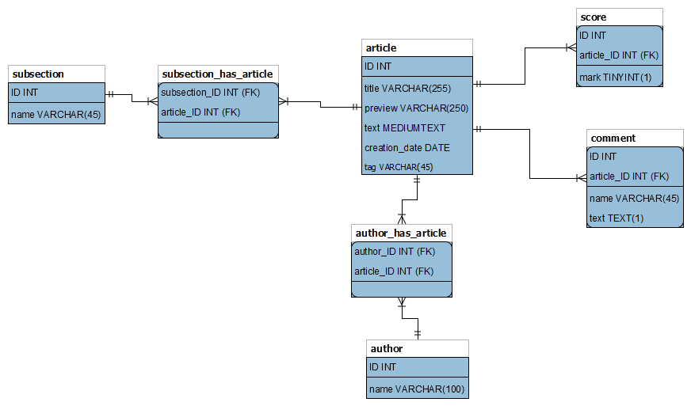

В файле DB.png представлена физическая схема представления модели.

В форматах .docx и .pdf представлены файлы описания модели и SQL запросы на получения всех комметариев и оценок ко всем публикациям указанного автора. 

Скрипт создания и заполенния БД представлен в файле braind_task1_2.sql.
